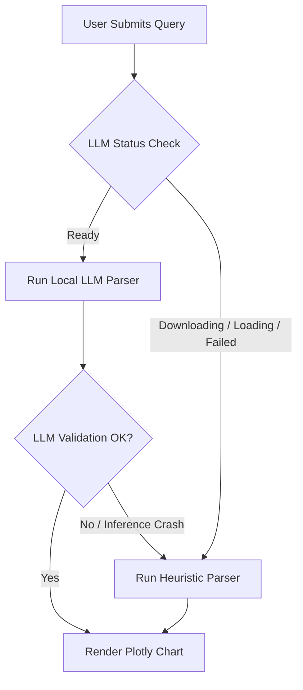

# Smart Visualization Agent

An offline-first, local AI-powered dashboard designed to ingest tabular datasets (CSV and Microsoft Excel formats) and generate interactive visualizations directly from natural language prompts. This project runs entirely offline on local hardware, ensuring data privacy and zero cloud execution costs.

---

## 📖 Quick Documentation Links
*   ⚙️ **[Technical Setup Instructions (setup.md)](setup.md)**: Details machine pre-requisites, environment setup, package installations, manual/automated model downloads, and troubleshooting port blocks.
*   📘 **[User Workflow Manual (guide.md)](guide.md)**: End-user handbook explaining query phrasing, supported chart types, manual adjustments, sidebar collapse, and dark/light modes.

---

## Technical Overview

The **Smart Visualization Agent** integrates a FastAPI backend with a modern, responsive single-page application (SPA) frontend. User queries are interpreted using a hybrid parsing pipeline that combines a local quantized Large Language Model (LLM) with a highly optimized, rule-based heuristic processor. Interactive visualizations are generated server-side using Plotly and rendered client-side.

### Key Architecture Components

*   **FastAPI Backend Server**: Exposes asynchronous endpoints for listing files, uploading new datasets, retrieving system compatibility metrics, and performing natural language visualization parsing.
*   **Hybrid Parser Coordinator (`core/parser.py`)**:
    *   *Local LLM Inference*: Integrates the `gpt4all` Python SDK to run a quantized 3B-parameter model.
    *   *Rule-Based NLP Engine*: A zero-setup, zero-RAM keyword mapping processor that utilizes regex token matching and data-type priority mapping to resolve chart parameters instantly.
*   **Visualizer Engine (`core/visualization.py`)**: Uses Plotly Express to generate chart configurations (supporting bar, line, scatter, histogram, and pie charts) and styles them dynamically to match active theme layouts.
*   **Single-Page Interface**: Built with high-fidelity glassmorphic panels, glowing indicator states, a live spreadsheet viewer, manual overrides, and a visual history card for restoring previous charts.

---

## Detailed Model & LLM Integration

The application integrates the **`orca-mini-3b-gguf2-q4_0.gguf`** Large Language Model (approx. 1.98 GB) via the `gpt4all` Python SDK.

### LLM Specifications
*   **Model Size**: 3 Billion Parameters (quantized to 4-bit integer weights).
*   **Quantization**: `q4_0` (reduced RAM footprint to ~3.5 GB during active inference, enabling smooth execution on 8GB-16GB machines).
*   **Execution Backend**: Defaults to CPU execution optimized via llama.cpp (compiled using AVX/AVX2 instructions). It will check for NVIDIA CUDA GPU hardware on startup but does not fail if CUDA is missing, falling back automatically to AVX-accelerated CPU execution.

### Prompt Engineering & JSON Constraints
The LLM is prompted using a structured chat session containing a strict system prompt. The model is instructed to act as a structured parser, returning a JSON mapping containing only the configuration keys without markdown wrapping:
```json
{
  "chart_type": "bar" | "line" | "scatter" | "histogram" | "pie",
  "x": "column_name_for_x_axis",
  "y": "column_name_for_y_axis_or_list_of_columns"
}
```
The python wrapper executes regex extractions on the model output to isolate the JSON block, parses it, and validates that the resolved X and Y columns match actual headers in the active dataset. If validation fails, it triggers the fallback pipeline.

---

## Deep Dive: Fallback Architecture & Engine Differences

To guarantee the application is functional immediately upon boot, it uses a tiered **Hybrid Parsing Pipeline** that handles hardware, download, and execution fallbacks automatically.

### The Fallback Lifecycle



1.  **Hardware Check Fail**: During startup, if checks find the CPU lacks AVX instructions, RAM is insufficient, or disk space is low, the status is set to `Unsupported` and the front-end buttons for LLM parsing are locked out. The backend permanently routes queries through the heuristic engine.
2.  **Model Missing / Loading Fail**: If the model weights are not downloaded, the system runs heuristics. If the user clicks **Download Model** and the download fails or the weights load with errors (such as missing CUDA DLLs), the coordinator catches the exception and routes to heuristics.
3.  **Inference Fail**: If the model times out, fails to generate a parseable JSON block, or selects columns that do not exist, the coordinator catches the error, logs the failure, and runs the heuristic engine to return a valid chart config.

### Engine Comparison: LLM vs. Heuristics

| Feature / Metric | Local LLM Engine (`orca-mini-3b`) | Rule-Based Heuristic Engine |
| :--- | :--- | :--- |
| **Parsing Strategy** | Probabilistic Deep Learning | Deterministic Regex & String Distance |
| **RAM Footprint** | ~3.5 GB (during inference) | **0 MB** |
| **CPU Overhead** | High (100% active cores during token generation) | **Sub-millisecond (negligible)** |
| **Setup Dependency** | Requires 1.98 GB model download | **Zero setup (runs out-of-the-box)** |
| **Fuzzy Reasoning** | High (handles synonyms like "correlate", "growth", "vs") | Medium (relies on token matching and stop-word rules) |
| **Multi-series Handling**| Resolves comparative structures dynamically | Groups multiple numeric columns based on search lists |
| **Ideal For** | High-spec laptops, complex queries, fuzzy column names | Low-spec laptops, instant charts, simple phrasing |

---

## Hardware Auto-Scanning Logic

The system runs diagnostics via `check_system_compatibility()` in `core/parser.py` using standard python libraries:
*   **CPU Instruction Set**: Scans the CPU for AVX/AVX2 support (mandatory for llama.cpp CPU execution). On Windows, it calls the Windows Kernel API directly (`IsProcessorFeaturePresent(19)`) to test for AVX. On macOS, it reads `sysctl`. On Linux, it inspects `/proc/cpuinfo`.
*   **System RAM**: Evaluates your total and available memory using `psutil`. It requires at least 6.0 GB of total RAM and 1.5 GB of free RAM to allow model execution.
*   **Free Disk Storage**: Verifies that the drive has at least 2.5 GB of free space (using `shutil.disk_usage`) to fit the model binary.
*   **64-Bit OS**: Confirms that your CPU architecture is 64-bit to prevent address space limitations.

---

## Directory Structure

```
smart-visualization-agent/
│
├── app/                     # Web Application Layer
│   ├── static/              # Static Frontend Assets
│   │   ├── script.js        # DOM events, uploader, Plotly theme toggler, overrides
│   │   └── style.css        # Responsive glassmorphism styling, theme variables
│   ├── templates/           # HTML Templates
│   │   └── index.html       # Single-Page Dashboard structure
│   ├── main.py              # Application entry point & lifespan events
│   └── routes.py            # API routes (upload, visualize, dataset details, status)
│
├── core/                    # Computational & Inference Layer
│   ├── parser.py            # Natural language processing (LLM & heuristic NLP parser)
│   └── visualization.py     # Plotly Express engine & design customization
│
├── data/                    # Dataset Storage Directory
│   ├── sample.csv           # Default US Exports dataset
│   └── sample2.csv          # Secondary comparison dataset
│
├── tests/                   # Verification Layer
│   └── test_parser.py       # pytest test suite
│
├── requirements.txt         # Project Dependencies list
├── README.md                # Technical Documentation
└── guide.md                 # User Workflow Manual
```

---

## Installation & Setup

Follow these steps to configure the environment and run the application locally.

### 1. Set Up and Activate Virtual Environment
Use the global Python virtual environment configured for your workspace:
```powershell
# On Windows (PowerShell)
& "C:\MyEnv\Scripts\Activate.ps1"
```

### 2. Install Project Dependencies
Run `pip` to install the package requirements listed in `requirements.txt`:
```powershell
pip install -r requirements.txt
```

### 3. Launch the Application Server
Run the FastAPI development server using `uvicorn`:
```powershell
uvicorn app.main:app --reload
```

The application will launch on your local host: **`http://127.0.0.1:8000`**

---

## Operating Instructions & Workflow

1.  **Ingest Dataset**:
    *   Select a pre-loaded sample dataset (like `sample.csv` or `sample2.csv`) from the sidebar.
    *   Alternatively, drag and drop a custom CSV or Excel (`.xlsx`/`.xls`) file into the dashboard's drop zone.
    *   *Pro-Tip*: You can also ingest datasets in bulk by copy-pasting your `.csv` or `.xlsx` files directly into the project's `/data` directory. They will appear in the dataset list automatically!
2.  **Verify Schema**:
    *   The **Dataset Preview** panel at the bottom will render the first 5 rows and indicate column data types (categorical vs. numeric).
3.  **Submit Visual Query**:
    *   Type a natural language command into the prompt input box and hit **Generate Chart** (or press Enter).
    *   *Example Queries*:
        *   `Show total exports by state` (renders a bar chart)
        *   `Scatter plot poultry vs total exports` (renders a scatter plot)
        *   `Line chart of dairy production` (renders a line plot)
        *   `Compare corn and wheat exports` (renders a grouped multi-series comparison chart)
        *   `Histogram of cotton values` (renders a distribution histogram)
4.  **Local LLM Syncing**:
    *   Upon application startup, the local LLM (`orca-mini-3b-gguf2-q4_0.gguf`) begins downloading in the background if system checks pass.
    *   The sidebar indicator status displays **LLM: Loading...** while downloading and **LLM: Ready** once loaded.
    *   If the LLM is loading or download fails, the agent uses the heuristic NLP engine immediately. You can manually force the parsing mode using the headers button group.
5.  **Refine & Correct**:
    *   If the agent maps an incorrect column or chart type, expand the **Manual Chart Adjustments** panel to override and select your axes directly.
6.  **Toggle History**:
    *   Click on any past query in the **Session History** list to instantly reload the chart.

---

## Running the Verification Suite

Unit tests verify that column mapping and chart parameters are generated correctly. To run the automated test suite, execute:
```powershell
python -m pytest tests/
```
